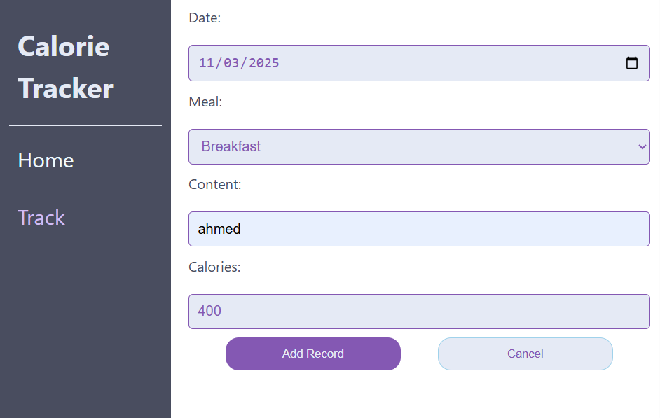

# 🥗 Calorie Tracker Project

A modern **React + Vite** demo application with a small Node.js server that allows users to **track, add, edit, and delete daily calorie records**.  
This project demonstrates **full CRUD operations** and how to integrate a React frontend with a lightweight backend API.

---

## 🚀 Live Demo
🔗 [View Live App](https://calorie-tracker-app12.vercel.app/)

---

## 📸 Screenshots



## ⚙️ Tech Stack

| Layer | Technologies |
|-------|---------------|
| **Frontend** | React, Vite, JavaScript (ES6+), Tailwind CSS |
| **Backend** | Node.js, Express.js, SQLite (in-memory) |
| **Deployment** | Vercel (client) |
| **Version Control** | Git & GitHub |

---

## ✨ Features

- 📆 View calorie records for the past 60 days.  
- ➕ Add new meals and calorie data.  
- 📝 Edit or delete existing records.  
- 🔄 Fetch requests to a small server using RESTful API.  
- 📱 Fully responsive and simple UI built with React + Tailwind.  
- ⚡ Fast loading with Vite.

---

## 🛠️ Setup & Run

### 1️⃣ Install Node.js

Make sure you have Node.js installed.

### 2️⃣ Install project dependencies
```bash
npm install-all


### 3️⃣ Start client and server
npm run start

### 4️⃣ Stop the project

Press Ctrl + C to close both the client and server.

🧩 API Endpoints
Method	Endpoint	Description
GET	/records	List all calorie records
GET	/records?date=YYYY-MM-DD	Get records for a specific date
POST	/records	Add a new calorie record
PUT	/records/:id	Update a specific record
DELETE	/records/:id	Delete a record


More details can be found in _packages/server/README.md_
